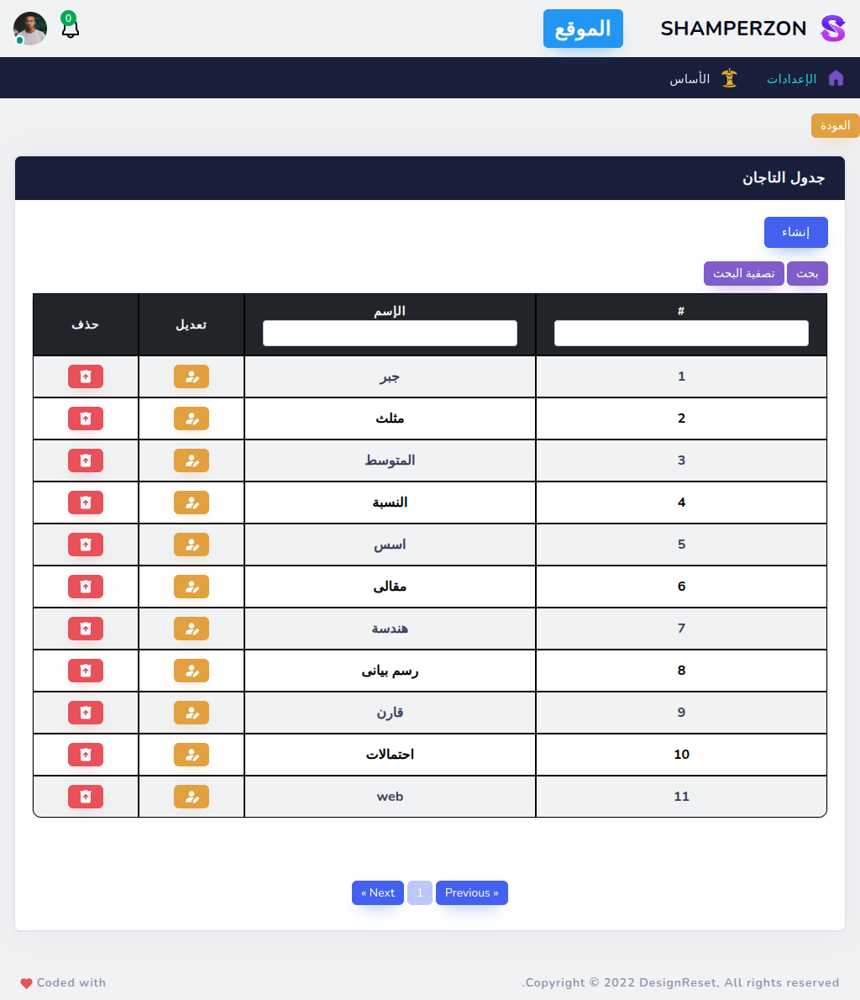

# shamperzon

https://www.shamperzon.com/app

----------

# Frontend
* Svelte
* SvelteKit

### Landing Page

### Register Page

### Subjects Page

### Question Page

### Question Answered Wrong

### Question Answered Correct

### Exam Is Finished

### All Exams And Can Continue Or Review

----------

# Backend
* PHP
* Laravel

### Admin Login

### Main Info Page

### Users Table

### Create Users

### Edit Users

### Roles Table

### Roles Permissions

### Countries Table

### Subjects Table

### Tags Table

### Qlevels Table

### Questions Table

### Question Show

### Exams Table

### Add Question To Exam

### Students Table

### Student Exams
